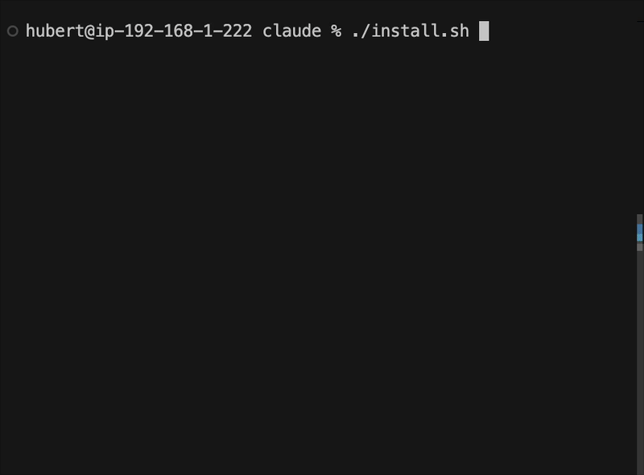

# Claude Providers

A simple installer that sets up Claude Code to work with different LLM providers, giving you the flexibility to switch between models while keeping the familiar Claude Code interface.

## Demo



## Features

- **Multiple LLM Providers**: Support for GLM (z.ai), MiniMax, OpenRouter, LM Studio (local), and Llama.cpp (local)
- **Simple Installation**: One command to set up any provider
- **Auto-Approval Mode**: Each provider includes an `-auto` version for automation
- **Cross-Platform**: Works on macOS and Linux
- **No Configuration Files**: Just enter your API key and go

## Quick Install

Install directly from GitHub:
```bash
curl -sSL https://raw.githubusercontent.com/hubertkirch/claude-providers/main/install.sh | bash
```

Or clone and run locally:
```bash
git clone https://github.com/hubertkirch/claude-providers.git
cd claude-providers
./install.sh
```

## Supported Providers

| Provider | Description | Models | Command |
|----------|-------------|--------|---------|
| **GLM** | Fast and efficient models from z.ai | GLM-4.7 | `claude-glm` |
| **MiniMax** | Specialized AI capabilities | MiniMax-M2.1 | `claude-minimax` |
| **OpenRouter** | Access multiple models with one API | Various (specify with `--model`) | `claude-openrouter` |
| **LM Studio** | Local models via litellm proxy | Any local model (specify with `--model`) | `claude-lmstudio` |
| **Llama.cpp** | Local llama-server via litellm proxy | Any GGUF model (specify with `--model`) | `claude-llamacpp` |

## Usage Examples

### Interactive Installation
```bash
./install.sh
# Follow the menu to select and configure providers
```

### Quick Installation
```bash
# Install specific provider
./install.sh glm YOUR_API_KEY
./install.sh minimax YOUR_API_KEY
./install.sh openrouter YOUR_API_KEY
./install.sh lmstudio    # Local - no API key needed
./install.sh llamacpp    # Local - no API key needed

# Install all cloud providers at once
./install.sh all
```

### Using Installed Providers

**GLM Example:**
```bash
claude-glm "Write a Python web scraper"
claude-glm-auto -p "Analyze this code for security issues"
```

**MiniMax Example:**
```bash
claude-minimax "Explain quantum computing"
claude-minimax-auto -p "Generate unit tests for my function"
```

**OpenRouter Example (requires model selection):**
```bash
claude-openrouter --model "mistralai/devstral-2512" "Write a React component"
claude-openrouter-auto --model "moonshotai/kimi-k2-thinking" -p "Review my code"
```

Popular OpenRouter models:
- `mistralai/devstral-2512`
- `moonshotai/kimi-k2-thinking`
- `google/gemini-pro`
- `meta-llama/llama-3.1-70b`

See [OpenRouter Models](https://openrouter.ai/models) for the complete list.

**LM Studio Example (requires model selection):**
```bash
claude-lmstudio --model "devstral-small-2-24b-instruct-2512" "Explain this code"
claude-lmstudio-auto --model "qwen2.5-coder-7b-instruct" -p "Write unit tests"
```


The model name should match a model loaded in LM Studio. A litellm proxy starts automatically on first run.

**Llama.cpp Example (requires model selection):**
```bash
claude-llamacpp --model "qwen2.5-coder-32b" "Explain this code"
claude-llamacpp-auto --model "GLM-4.7-Flash" -p "Write unit tests"
```

First, start llama-server with your GGUF model:
```bash
llama-server -m /path/to/model.gguf --port 8080
```

The model name is used for routing and can be any identifier you choose. A litellm proxy starts automatically on first run.

## Management Commands

```bash
# List installed providers
./install.sh list

# Remove a provider
./install.sh remove glm
./install.sh remove minimax
./install.sh remove openrouter
./install.sh remove lmstudio
./install.sh remove llamacpp

# Show help
./install.sh help
```

## Requirements

- **Claude Code** must be installed first ([Download](https://claude.ai/download))
- **Bash** 3.0 or higher
- **macOS** or **Linux**
- **Poetry** (only required for LM Studio and Llama.cpp support) - [Install Poetry](https://python-poetry.org/docs/#installation)

## Installation Details

The installer:
1. Detects your Claude Code installation
2. Creates wrapper scripts in `~/.local/bin` or `/usr/local/bin`
3. Sets up environment variables for each provider
4. Configures both standard and auto-approval versions

Each provider runs in complete isolation with its own configuration directory.

## Auto-Approval Mode

Commands ending with `-auto` use the `--dangerously-skip-permissions` flag for fully automated operation:

```bash
# Standard mode - will ask for permissions
claude-glm "Your prompt"

# Auto mode - no permission prompts (use with caution)
claude-glm-auto -p "Your prompt"
```

**Warning**: Only use auto-approval mode in trusted environments or sandboxes.

## Troubleshooting

### Command not found
Add the installation directory to your PATH:
```bash
export PATH="$HOME/.local/bin:$PATH"
```
Add this line to your `~/.bashrc` or `~/.zshrc` to make it permanent.

### API key issues
Re-run the installer to update your API key:
```bash
./install.sh glm NEW_API_KEY
```

### OpenRouter model parameter
OpenRouter always requires the `--model` parameter:
```bash
# Won't work
claude-openrouter "Hello"

# Correct usage
claude-openrouter --model "mistralai/devstral-2512" "Hello"
```

### LM Studio connection issues
Make sure LM Studio is running and the API server is enabled:
1. Open LM Studio
2. Load a model
3. Go to the "Local Server" tab and start the server
4. Default address is `http://localhost:1234/v1`

You can override the LM Studio address with the `LMSTUDIO_API_BASE` environment variable:
```bash
LMSTUDIO_API_BASE="http://192.168.1.100:1234/v1" claude-lmstudio --model "my-model" "Hello"
```

### Llama.cpp connection issues
Make sure llama-server is running:
```bash
# Start llama-server with your model
llama-server -m /path/to/model.gguf --port 8080

# With GPU acceleration
llama-server -m /path/to/model.gguf --port 8080 -ngl 99
```

Default address is `http://localhost:8080/v1`. You can override it with the `LLAMACPP_API_BASE` environment variable:
```bash
LLAMACPP_API_BASE="http://192.168.1.100:8080/v1" claude-llamacpp --model "my-model" "Hello"
```

## Security

- API keys are stored only in the script files with `700` permissions (owner read/write/execute only)
- No API keys are logged or stored in configuration files
- Each provider runs in isolation with its own `CLAUDE_HOME` directory

## License

MIT License - See [LICENSE](LICENSE) file for details.

## Contributing

Contributions are welcome! Please:
1. Test with the relevant providers
2. Update documentation as needed
3. Follow the existing code style

## Author

[Hubert Kirch](https://github.com/hubertkirch)

---

**Note**: This project is not affiliated with Anthropic or any of the LLM providers mentioned. It's a community tool to enhance the Claude Code experience.# test
